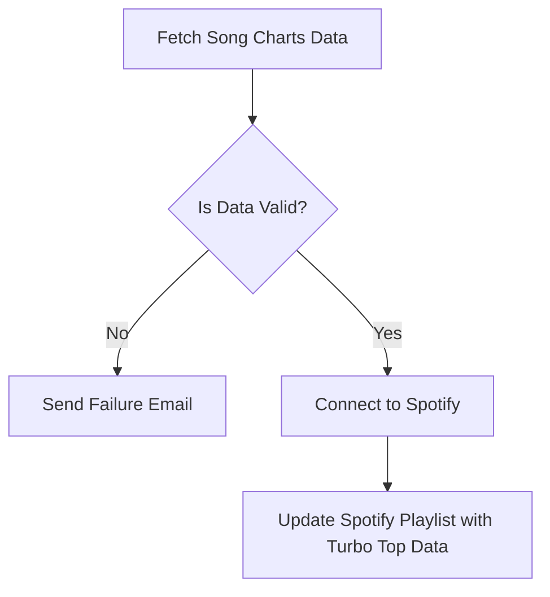

# Spotify Playlist Updater

## What it does.

Fetches data from source and updates a Spotify playlist. 
If the data fetching or playlist updating fails, it sends an email notification.

In this case the source for playlist is the Turbo Top chartlist (see https://player.antyradio.pl/Turbo-Top)

## Key Steps

1. **Initialize Config and Email Sender**: 
    - The configuration file is loaded, and an email sender is prepared.

2. **Fetch Turbo Top Data**: 
    - The system retrieves the latest Turbo Top data.

3. **Is Data Valid?**:
    - A check is made to see if the data is valid.
    - If **No**, an email is sent to notify of the failure.
    - If **Yes**, the process continues.

4. **Connect to Spotify**: 
    - The system connects to Spotify using the credentials from the configuration.

5. **Update Spotify Playlist**: 
    - The Turbo Top playlist is cleared and updated with the new tracks.

## Installation
1. Clone this repository
2. Install dependencies from `requirements.txt`
3. rename `config-template.json` to `config.json` 
4. update the `config.json` accordingly to your gmail client (see: https://developers.google.com/gmail/api/quickstart/python) and spotify app (see: https://developer.spotify.com/dashboard/)
5. run `python update_playlist.py`

## Example result

